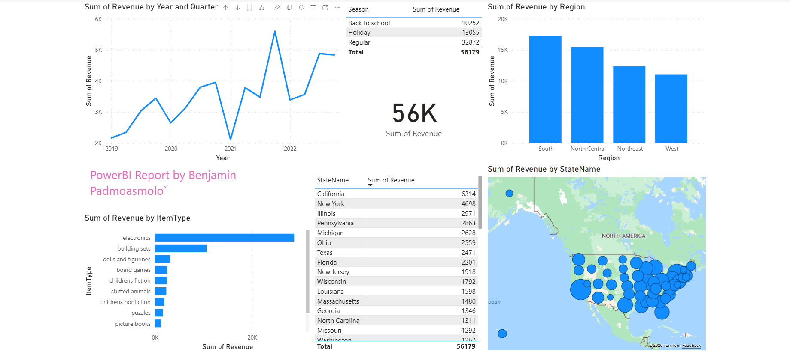

<div align="center">

# Toy Store Sales Analytics Dashboard

**An interactive Power BI report analyzing toy store sales performance across product categories, regions, and time.**

[](https://app.powerbi.com/view?r=eyJrIjoiNmY1YjQ2OGUtNmFhZi00NjY0LTllNDEtMGYzNjllZjBiZjc5IiwidCI6IjIyMTc3MTMwLTY0MmYtNDFkOS05MjExLTc0MjM3YWQ1Njg3ZCIsImMiOjN9)


</div>

---

<!-- Optional preview image.
     Export a screenshot from Power BI (File → Export → Export to PDF, or screenshot the canvas),
     save it as `dashboard.png` in the repo root, then uncomment the line below.


-->

## Overview

This single-page executive dashboard turns raw toy store sales data into the questions a marketing or category manager actually cares about:

- **Where** is revenue coming from geographically?
- **What** product categories drive the top line?
- **When** does demand spike — which months, seasons, regions?
- **How** has performance trended over time?

Click **▶ View Live Dashboard** above to interact with the report in your browser — no install, no login.

## Key Insights Surfaced

| Question | Visualization |
| --- | --- |
| What is total revenue at a glance? | KPI card |
| Which product types sell the most? | Clustered bar chart — Revenue by Item Type |
| Where is revenue concentrated geographically? | Azure Map + state-level table |
| How does revenue trend over time? | Line chart with Year → Quarter → Month → Day drill-down |
| How do regions compare? | Clustered column chart — Revenue by Region |
| Is there a seasonal pattern? | Revenue by Season table |

## Tools & Techniques

- **Microsoft Power BI Desktop** — data modeling, DAX measures, report design
- **Power BI Service** — published to the web for interactive viewing
- **Azure Maps** — geospatial visualization of state-level revenue
- **Date hierarchy drill-down** — interactive time-series exploration from annual to daily
- **Aggregated measures** — `SUM(Revenue)` as the core metric across dimensional cuts

## Data Model

Built on a single fact table, `ToyStore`, with the following dimensions:

| Field | Description |
| --- | --- |
| `ItemType` | Product category |
| `StateName` / `Region` | Geography |
| `Date` | Year / Quarter / Month / Day hierarchy |
| `Season` | Seasonal bucketing |
| `Revenue` | Primary metric |

## How to View

**In your browser (recommended):** click the [▶ View Live Dashboard](https://app.powerbi.com/view?r=eyJrIjoiNmY1YjQ2OGUtNmFhZi00NjY0LTllNDEtMGYzNjllZjBiZjc5IiwidCI6IjIyMTc3MTMwLTY0MmYtNDFkOS05MjExLTc0MjM3YWQ1Njg3ZCIsImMiOjN9) button above — fully interactive, no install required.

**Locally, with the source file:**

1. Download `Benjamin_PowerBI_MKT317.pbix` from this repo
2. Open it with [Power BI Desktop](https://powerbi.microsoft.com/desktop/) (free, Windows)
3. Click any bar, map state, or legend item to cross-filter the rest of the page

## Repository Contents

```
powerbi-marketing-analytics-dashboard/
├── Benjamin_PowerBI_MKT317.pbix   Power BI report (source)
└── README.md                       This file
```

## About

Built by **Benjamin Padmoasmolo** as part of a marketing analytics portfolio. Demonstrates end-to-end BI skills: data ingestion, dimensional modeling, DAX measure design, geospatial visualization, and executive-ready dashboard layout.

<div align="center">

---

*Interested in the analysis or looking to discuss marketing analytics roles?*
*Open an issue or reach out via GitHub.*

</div>
